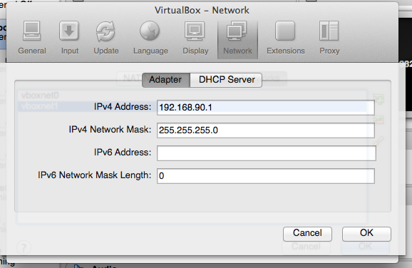

# Vagrant HDP VM Cluster Buildout
===========

Vagrant configurations for VM and VM Cluster configurations.

[Vagrant](http://www.vagrantup.com) is used to automate the provisioning of hosts via "VirtualBox" or "VMware Fusion".  To start, you need a base VM.  The references I used are below, but save yourself some time and headache by downloading the VirtualBox base machine I've created from Dropbox. Link below.

Once you've retrieved the prepared VagrantBox, add it to your vagrant box list with:

`vagrant box add CentOS_64_x64 <box-location>`

# Vagrant Plugin's Used

- vagrant-hostmanager (1.2.3)
- (optional) vagrant-vmware-fusion (2.0.8)
- vagrant-librarian-chef (0.1.4)

Vagrant uses [chef](http://docs.opscode.com) to configure the boxes.  I've created several special chef recipes for HDP to assist with the process.  If you're interested, they can be found [here](https://github.com/dstreev/chef_recipes).

# Get the Boxes and keys

Save yourself some time and download the preconfigured VagrantBox for VirtualBox.  The box 'CentOS_64_x64.20131022.virtualbox.box' includes a *vagrant* user with the *keys* in the 'keys' folder.  Copy the 'keys/vagrant' file (the ssh private rsa key) to your ~/.ssh directory.  The Vagrantfile's created in the vagrant projects below will override the default ssh keys expected by vagrant and use this one.

[Dropbox](https://www.dropbox.com/sh/eamvf0ilsu8y68k/9w1fY-AmcR)

The keys above are used by `vagrant ssh` to log into the boxes that are built.  The template box, above, has been built with an additional user `vagrant` that has `sudo` rights on the box.

# Projects

If you use the projects here without modifications, you'll need to create a network in VirtualBox that matches the 192.168.90/24 network used in these configurations. 

VirtualBox -> Preferences -> Network -> Host-only Networks.

## [HDP Repo](hdp_repo)

*WARNING*: The above box is configured with a 20GB HD, which will *NOT* be enough to support the HDP Repo.  You have four options:
- Find another vagrant CentOS Base Virtual Box to use for this installation. Try (www.vagrantbox.es). I'm working on building a base next. ;^)
- Build a large enough Box for the installation on your own.  I've included a bunch of tips 'below' that will help you build a VirtualBox VM that can be used by Vagrant.
- Start with the above box and add another HDD to it via VirtualBox.  You'll need to extend the LVM to include the additional drive.

Once you've acquired a box sizable enough to build a repo (35GB at least), use the `Vagrantfile` in this project to configuring and populate it with sync'd repos and some key artifacts needed to assist with the build of an HDP cluster via "local repo".

## [HDP Cluster Buildout](hdp_cluster_buildout)

This Vagrant project is configured to buildout a 3 node cluster and install Ambari on the `tmstr` node.  Ambari will be configured to pull from internet repos sources. 

## [HDP Cluster Buildout - Local Repo](hdp_cluster_buildout_local)

This Vagrant project is configured to buildout a 3 node cluster and install Ambari on the `tlmstr` node.  Ambari will be configured to use the local-repo above. 

# Observations / tips

1. If you want to use VMware Fusion as your 'default' provider, add `VAGRANT_DEFAULT_PROVIDER=vmware_fusion` to your environment.  Beware, if you also use 'VirtualBox' you'll have to specifically supply the `--provider` flag for most commands, to overcome the default set by the environment variable.

# Creating a base CentOS 6.4 Base VM
<table>
<tr><th>
Provider
</th><th>
References
</th><th>
Notes
</th></tr>
<tr><td>
Both
</td><td>
(http://cbednarski.com/articles/creating-vagrant-base-box-for-centos-62/)
</td><td>
Really great start, but has a few errors in it. IE: odf should be ovf for the Virtual Box Installations
</td></tr>
<tr><td>
vmware_fusion
</td><td>
(http://vmtrooper.com/vagrant-static-external-ip-addresses-with-the-vmware-fusion-provider/)
</td><td>
I have not been able to create a VM Fusion Box that works yet.
</td></tr>
<tr><td>
Both
</td><td>
(https://gist.github.com/bkuberek/5266195)
</td><td>
When you finally get your box working, these steps will be necessary the allow the vagrant hostmanager plugin.  This guide was for SUSE, but is relevant, partly, for RHEL/CentOS.  Line 12+ are good for RHEL/CentOS.
</td></tr>
<tr><td>
Both
</td><td>
none
</td><td>
I've created an SSH key pair that I use with my base VM's, instead of the keys that are "WELL" known for vagrant.  Use the vagrant SSH configuration settings describe here to make this transparent: (http://docs.vagrantup.com/v2/vagrantfile/ssh_settings.html)
</td></tr>
<tr><td>

</td><td>

</td><td>

</td></tr>
<tr><td>

</td><td>

</td><td>

</td></tr>
</table>

